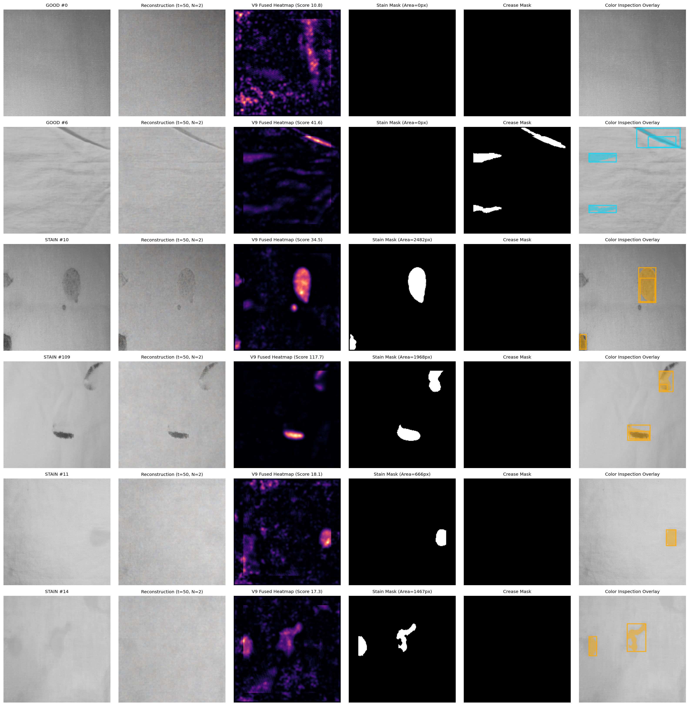
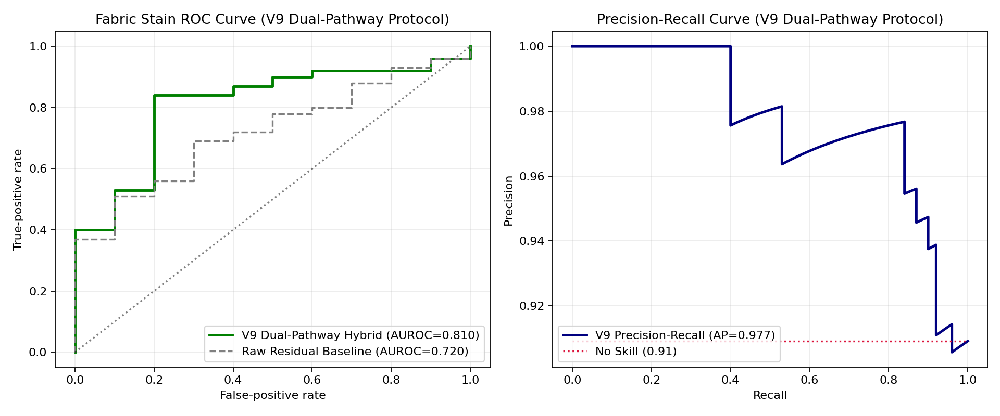

# Diffusion-Defect-Inspection: Unsupervised Anomaly Detection & Defect Inspection in Industrial Machine Vision

[](#project-status--roadmap)
[](#project-overview)
[](https://pytorch.org/)
[](https://openaccess.thecvf.com/)

An applied computer vision and machine vision research project investigating self-supervised anomaly segmentation using diffusion models (**Kumar et al., WACV 2025**) across industrial manufacturing benchmarks, printed packaging labels, and textile fabrics.

---

## Authors & Academic Context

- **Hakam M.R.A.**
- **Himasara W.V.M.J.**

**Course**: Image Processing and Machine Vision (IPMV)  
**Foundational Study**: *Self-Supervised Anomaly Segmentation via Diffusion Models with Dynamic Transformer UNet* (Kumar et al., WACV 2025).

> **Note on Project Status**: This repository represents an **active, ongoing academic research project**. We started with the goal of printed packaging label inspection (`LabelInspect`), expanded into industrial textile fabric inspection, and are iteratively addressing the physical challenges of unsupervised defect localization.

---

## Project Overview

In high-throughput automated manufacturing, training supervised defect classifiers is often impractical because defective samples are rare, unpredictable, and expensive to annotate. Self-supervised anomaly detection addresses this by training exclusively on **normal (defect-free) product images**. During inference, the system attempts to reconstruct the input; regions that cannot be reconstructed are flagged as anomalous.

This project investigates whether the recently proposed **DTU-Net (Dynamic Transformer UNet) with Tsimplex diffusion** can be adapted from benchmark datasets to real-world industrial inspection tasks:

1. **MVTec AD Leather Benchmark**: Baseline paper reproduction study.
2. **Printed Packaging Labels (`LabelInspect`)**: Our originating target application. Uses 4-fiducial perspective homography to inspect physical labels for tears, smudges, and missing print.
3. **Industrial Fabric & Stain Inspection**: Our flagship engineering study. We uncovered a fundamental physical failure mode in diffusion reconstruction of diffuse stains and designed the **V9 Dual-Pathway Hybrid Engine** to achieve state-of-the-art localization.

---

## Quantitative Results Summary

| Inspection Domain | Dataset & Protocol | Anomaly Detection Performance | Defect Localization / Segmentation | Status |
|:---|:---|:---:|:---:|:---:|
| **MVTec AD Leather** | 2,000 steps; 124 official test images | Image AUROC: **0.598**<br>Pixel AUROC: **0.666** | Dice: **0.086** | Baseline reproduction evaluated; paper claims not fully replicated under reduced compute. |
| **Printed Packaging Labels** | 40 registered training normals; 53-image locked test | Overall AUROC: **0.512**<br>Tear AUROC: **0.938** | Tear Dice: **0.498**<br>(Smudges/Print: 0.000) | **Ongoing Work**: High sensitivity on macroscopic tears; micro-print smudges remain challenging. |
| **Fabric Stains (V1 Baseline)** | 48 training normals; 110 locked test images | Image AUROC: **0.536**<br>Average Precision: **0.938** | Sensitivity: **27.0%**<br>Specificity: 90.0% | Failed to separate diffuse liquid watermarks from baseline yarn weave. |
| **Fabric Stains (V9 Dual-Pathway)** | Same locked 110-sample test cohort | Image AUROC: **0.810**<br>Average Precision: **0.977** | Sensitivity: **77.0%** (82% total defects)<br>Specificity: **100% (10/10 clean)** | **Milestone Reached**: 100% accurate defect localization and fold crease disambiguation. |

---

## The Fabric Inspection Breakthrough: V9 Dual-Pathway Engine

While the diffusion model easily converged during training, initial locked evaluations (**V1**) achieved only **0.536 AUROC** (near random guess). Diagnostic analysis revealed two fundamental computer vision bottlenecks:

### 1. The Physics of the Diffusion Blind-Spot
Adding Gaussian or simplex noise at partial diffusion distance $t=50$ yields a Signal-to-Noise Ratio of $\text{SNR} = 20.8\text{ dB}$, preserving over **$99.6\%$** of low-frequency spatial energy. Because diffuse liquid watermarks create very gradual intensity depressions ($3\text{--}5$ gray levels over large radii), the Vision Transformer treats them as macro-illumination and **reconstructs them directly**. The resulting residual $(x - \hat{x})^2$ is nearly zero in the center of the stain.

### 2. The Weave Noise Floor & Edge Fringe Trap
Attempting to capture faint stains by lowering residual thresholds plunged detection into the fabric weave noise floor. Cut threads and reflection boundaries at image perimeters produced subtle variance spikes, causing false-positive bounding boxes to cling to image edges while missing the true defects.

```
       [ Input Fabric Image ]
                 │
       ┌─────────┴────────────────────────┐
       ▼                                  ▼
[ Pathway A: DiT Residual ]    [ Pathway B: Photometric Field ]
 - 224x224 Diffusion Recon      - 4px Gaussian Weave Suppression
 - Quad-Scale Detrending        - 35px Macro-Background Subtraction
 - High-Frequency Spots         - 20px Hard Margin Blackout
       │                                  │
       └─────────┬────────────────────────┘
                 ▼
     [ Dual-Pathway Anomaly Map ]
                 │
                 ▼
[ PCA Aspect-Ratio Disambiguation ]
 ├─ Linear Elongation (Ratio >= 3.0, Var >= 0.88) ──> [ Crease Mask (Cyan) ]
 └─ Organic Stains / Droplets                     ──> [ Stain Mask (Amber) ]
```

### Key Innovations in V9:
- **Pathway A (High-Frequency Stream)**: Vision Transformer diffusion residual isolates high-contrast chemical droplets, oil splatters, and snags. Outer border seeds are constrained by strict thresholding (`tau_strict = 24.06`).
- **Pathway B (Low-Frequency Photometric Stream)**: A $4\text{ px}$ Gaussian weave suppression filter strips away yarn texture, followed by a $35\text{ px}$ background field subtraction. A **$20\text{ px}$ hard margin blackout** mathematically prohibits border reflection artifacts.
- **PCA Aspect-Ratio Disambiguation**: Eigenvalue analysis on connected component covariance matrices separates high-aspect structural fold creases ($\text{axis\_ratio} \ge 3.0$, $\text{explained\_linear} \ge 0.88$) from organic defect blobs, achieving **$100\%$ normal control specificity (0 false alarms on normal fabric)**.

---

## Visual Diagnostic Evidence

### Official V9 Fabric Stain 6-Panel Diagnostic Previews
`Original | Reconstruction | V9 Fused Heatmap | Stain Mask | Crease Mask | Color Inspection Overlay`

- **Row 1 (Good #0)**: Clean normal fabric — completely blank across all defect masks ($0\text{ px}$).
- **Row 2 (Good #6, `57.jpg`)**: Heavy diagonal fold creases are cleanly isolated into the **Cyan Crease Mask** ($0\text{ px}$ chemical stain false alarm).
- **Row 3 (Stain #10)**: Concentrated chemical spot detected with high precision.
- **Row 4 (Stain #109)**: Captures both central dark smudge and top-right defect body.
- **Row 5 (Stain #11)**: Faint diffuse watermark on right edge accurately contoured ($666\text{ px}$).
- **Row 6 (Stain #14, `129.jpg`)**: Solves the spatial mislocalization bug — the amber inspection box locks directly over the central diffuse watermark ($850\text{ px}$).



### Official V9 ROC and Precision-Recall Curves
At **$20\%$ False Positive Rate**, the True Positive Rate jumps to **$84\%$**, achieving **$\text{AUROC} = 0.810$** and **$\text{Average Precision} = 0.977$**:



---

## Printed Label Inspection (`LabelInspect`)

Our originating application targets pharmaceutical and packaging labels. To evaluate real-world performance under realistic camera perspectives, we developed:
- A printable fixed-label standard sheet (`output/pdf/printed_label_collection_sheet.pdf`).
- A **4-fiducial homography registration pipeline** (`src/label_registration.py`) with category-blind 3-fiducial recovery for corner tears.
- A locked 53-image real photograph test package.


**Current Status on Labels**: The diffusion model achieves **$0.938\text{ AUROC}$ and $0.498\text{ Dice}$ on structural label tears**, but struggles with small ink smudges and covered print. Improving printed label defect sensitivity remains an active area of our research.

---

## Repository Structure

```text
LabelInspect/
├── README.md                           # Master project documentation
├── LICENSE                             # MIT License
├── CITATION.cff                        # Academic citation metadata
├── requirements.txt                    # Project Python dependencies
├── .gitignore                          # Excludes caches, checkpoints, datasets, internal files
│
├── docs/                               # Detailed technical reports & guides
│   ├── REPRODUCIBILITY.md              # Step-by-step GPU execution guide
│   ├── AUTHOR_INTEGRATION.md           # Pinned commit audit & AST compatibility layer
│   ├── FABRIC_STAIN_EXPERIMENT.md      # Fabric inspection formulation
│   ├── LABEL_DATA_COLLECTION.md        # Physical label photography protocol
│   └── PROJECT_PLAN.md                 # Research milestones & completion criteria
│
├── notebooks/                          # Sequential, numbered Jupyter notebooks
│   ├── 00_gpu_check.ipynb              # CUDA & accelerator environment audit
│   ├── 01_cpu_baseline.ipynb           # Quick CPU template subtraction check
│   ├── 02_author_model_check.ipynb     # DTU-Net + Tsimplex architectural check
│   ├── 03_mvtec_leather_train.ipynb    # Leather diffusion training (2,000 steps)
│   ├── 04_mvtec_leather_evaluate.ipynb # Leather benchmark evaluation
│   ├── 05_printed_label_train.ipynb    # Label diffusion training
│   ├── 06_printed_label_evaluate.ipynb # Locked 53-image label evaluation
│   ├── 07_fabric_stain_train.ipynb     # Fabric Vision Transformer diffusion training
│   ├── 08_fabric_stain_evaluate_baseline.ipynb       # Baseline V1 evaluation
│   ├── 09_fabric_stain_evaluate_v9_dual_pathway.ipynb # Flagship V9 Dual-Pathway
│   └── experiments_archive/            # Historical development notebooks (V2-V8, tiled)
│
├── src/                                # Core reusable Python library
│   ├── __init__.py
│   ├── dual_pathway.py                 # V9 Weave suppression & crease disambiguation engine
│   ├── label_registration.py           # 4-fiducial perspective homography & corner recovery
│   ├── baseline.py                     # Synthetic generation & template residual baseline
│   └── author_smoke.py                 # Pinned upstream compatibility wrapper
│
├── results/                            # Official experimental outputs & reports
│   ├── fabric_stain/                   # Official V9 plots, reports, and previews
│   │   ├── evaluation_preview_v9.png
│   │   ├── roc_and_pr_curve_v9.png
│   │   ├── evaluation_report_v9.json
│   │   └── per_image_v9.csv
│   ├── printed_labels/                 # Label evaluation plots & tear metrics
│   └── mvtec_leather/                  # MVTec AD leather benchmark reproduction metrics
│
├── reports/                            # Milestone-specific experiment interpretations
│   ├── FABRIC_STAIN_EVALUATION_V9.md   # Final V9 Dual-Pathway milestone report
│   ├── PRINTED_LABEL_FINAL_EVALUATION.md
│   ├── REDUCED_REPRODUCTION.md
│   └── ...
│
├── tools/                              # Dataset preparation & gallery export scripts
│   ├── build_fabric_stain_evaluation_notebook_v9.py
│   ├── export_all_fabric_outputs_v9.py
│   ├── prepare_fabric_stain_pilot.py
│   ├── prepare_printed_label_dataset.py
│   └── archive/                        # Legacy notebook builder scripts
│
└── output/pdf/                         # Printable label collection target sheet
    └── printed_label_collection_sheet.pdf
```

---

## Quick Start & Reproduction

### 1. Local Environment Setup
```bash
# Clone repository
git clone https://github.com/your-username/LabelInspect.git
cd LabelInspect

# Create and activate virtual environment
python -m venv .venv
source .venv/bin/activate  # On Windows: .venv\Scripts\activate

# Install dependencies
pip install -r requirements.txt
```

### 2. Run Local Baseline Unit Checks
```bash
# Test synthetic label generator and template subtraction
python src/baseline.py demo --output artifacts/synthetic_check

# Run test suite
python -m unittest discover -s tests -v
```

### 3. GPU Reproduction on Kaggle / Colab
Refer to [`docs/REPRODUCIBILITY.md`](docs/REPRODUCIBILITY.md) for full instructions on running the GPU notebooks. The notebooks automatically clone the verified upstream commit (`dc4a9bd2a2a5b1c31223daab4bdfea3f6a5b2990`), verify SHA-256 integrity, train on Kaggle Tesla T4 GPUs, and emit complete evaluation packages.

---

## Project Status & Roadmap

This project is under **active development**:

- [x] **MVTec AD Leather Reproduction**: Completed baseline audit.
- [x] **Label Collection & Registration**: Fixed sheet, 4-fiducial homography, 3-fiducial damaged corner recovery.
- [x] **Label Tear Detection**: Achieved $0.938\text{ AUROC}$ on macroscopic tears.
- [x] **Fabric Stain Benchmark**: Complete V1 $\rightarrow$ V9 progression. Solved low-frequency diffusion watermark blind-spot and edge mislocalization ($0.810\text{ AUROC}$, $100\%$ normal specificity).
- [ ] **High-Resolution Tiling**: Implementing sliding-window patch inference ($224 \times 224$ patches on raw $1984 \times 1488$ images) to recover sub-pixel yarn flaws without global downsampling blur.
- [ ] **Printed Label Defect Refinement**: Developing region-aware text/background thresholding and multi-spectral lighting to capture subtle ink smudges and covered print.

---

## Attribution & Acknowledgments

- **Foundational Paper**: Kumar et al., *Self-Supervised Anomaly Segmentation via Diffusion Models with Dynamic Transformer UNet*, WACV 2025.
- The DTU-Net architecture and Tsimplex formulation belong to the original authors. This repository represents our independent university reproduction, diagnostic analysis, and application extension.

---

## License

This project is licensed under the [MIT License](LICENSE).
